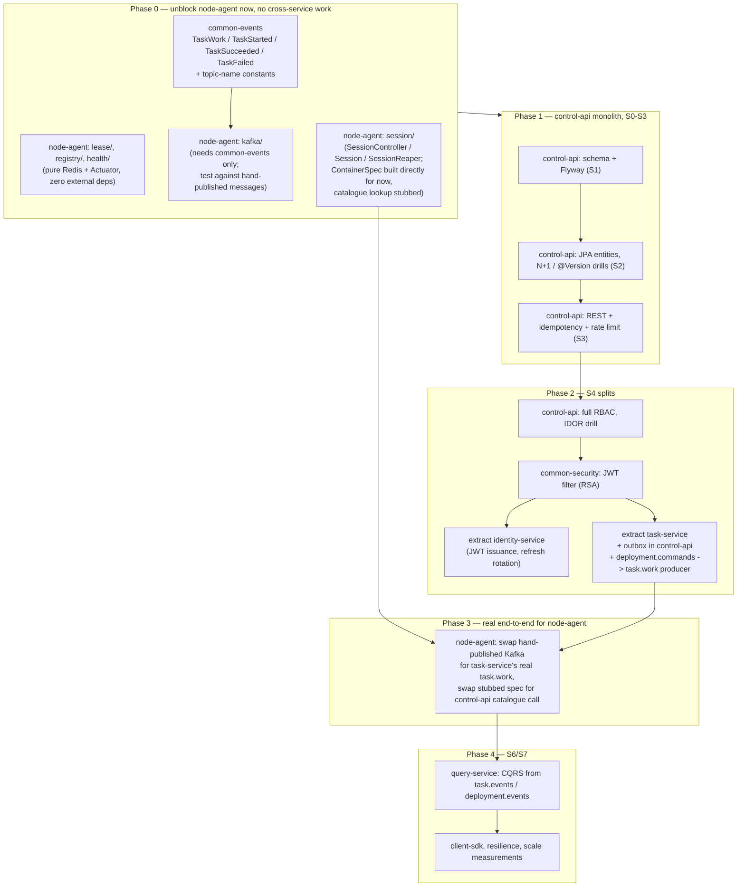

# Appfleet — service dependencies and build sequence

Cross-cutting companion to the per-service specs in
[`docs/specs/project/`](../specs/project/) and the overall plan in
[`docs/specs/SPRING-PROJECT.md`](../specs/SPRING-PROJECT.md). Those documents say
what the finished system looks like, slice by slice, in the intended order
(S0 → S7). This doc says where the repo actually stands against that plan as of
`node-agent-phase-0`, why one module got ahead of the plan, and what order to
finish the rest in so that head start isn't wasted or duplicated.

## Current implementation state

Checked directly against the tree, not the spec (`find */src -name "*.java"`):

| Module | State |
|---|---|
| `common-events` | Empty — only `pom.xml`. No schemas, no topic constants. |
| `common-security` | Empty — only `pom.xml`. No JWT filter. |
| `fleet-audit-starter` | Empty — only `pom.xml`. |
| `client-sdk` | Empty — only `pom.xml`. |
| `control-api` | Skeleton only (`ControlApiApplication`). No domain model, no REST, no outbox. |
| `identity-service` | Skeleton only. No RBAC, no JWT issuance. |
| `task-service` | Skeleton only. No Kafka consumer/producer, no retry/DLQ. |
| `query-service` | Skeleton only. No CQRS projection. |
| `node-agent` | **Ahead of plan** — `runtime/` package built (`ContainerRuntime`, `ContainerSpec`, `ContainerHandle`, `ContainerState`, `ContainerStatus`, `DockerRuntime`, `DockerRuntimeConfig`, `RuntimeAutoConfig`, `SimulatedRuntime`, `SwarmRuntime`), plus `config/` and a started `session/SessionService.java`. |

Infrastructure (`docker-compose.yml`, `infra/init-schemas.sql`) is fully scaffolded:
Postgres schema-per-service, Redis, Kafka in KRaft mode with `task.work` at 6
partitions and DLTs for `task.work`/topics already created on `kafka-init`. This
part of Slice 0 is done; the services that would use it are not.

## Why node-agent is ahead, and what that actually costs

`SPRING-PROJECT.md`'s build order is S0 (skeleton) → S1 (schema) → S2 (JPA) → S3
(REST + Redis) → **S4** (RBAC, extract identity-service, extract task-service,
introduce Kafka) → **S5** (extract node-agent) → S6 (query-service, patterns) →
S7 (resilience, client SDK). node-agent's `runtime/` package was built before
any of S0–S4 exists in `control-api`, `identity-service`, `task-service`, or the
two shared libraries node-agent's own `pom.xml` already depends on
(`common-events`, `common-security`).

This isn't necessarily wrong — [`node-agent.md`](node-agent.md) states explicitly
that the agent is meant to be developed and tested against `SimulatedRuntime`
plus hand-published Kafka messages, with no blocking dependency on the rest of
the build order. The `ContainerRuntime` abstraction itself has no dependency on
any other service. But it does mean some of node-agent's *remaining* work
(`session/`, `kafka/`) touches things that don't exist yet, and it's worth being
precise about which of those are real blockers and which aren't.

## Dependency classification — hard vs soft blockers

| Dependency | Blocks node-agent how | Hard block? |
|---|---|---|
| `common-events` | `TaskWork`/`TaskStarted`/`TaskSucceeded`/`TaskFailed` records and topic-name constants — `TaskWorkMapper`, `TaskWorkConsumer`, `TaskEventsProducer` cannot compile without it | **Yes.** node-agent's `pom.xml` already declares this dependency; nothing exists to import from it yet |
| `common-security` | A JWT filter for `/api/v1/sessions/**` | No — the spec doesn't require RBAC on node-agent's own REST surface; deferrable |
| `control-api` (catalogue) | `SessionService.provision()` is meant to resolve `appImageId` against control-api's catalogue, never invent config | No — `node-agent.md:17` explicitly allows developing against `SimulatedRuntime` with a stubbed spec until the catalogue exists |
| `task-service` (real `task.work` producer) | `TaskWorkConsumer` needs messages to consume | No — the spec explicitly allows hand-published Kafka messages for dev/test |
| `identity-service` | Issues the JWTs `common-security` validates | No — deferred together with `common-security` |

**Only one real compile-blocker: `common-events`.** Everything else node-agent
needs can keep being simulated or stubbed, per the spec's own stated allowance,
without contradicting the design.

## Recommended build sequence

## Practical next steps, in order

1. **`common-events`** — `TaskWork`, `TaskStarted`/`Succeeded`/`Failed` records,
   topic-name constants. Small, zero dependencies, unblocks node-agent's `kafka/`
   package immediately.
2. **Finish node-agent's dependency-free packages** — `lease/`, `registry/`,
   `health/`. Pure Redis/Actuator, nothing external needed.
3. **Finish node-agent's `kafka/` package** against (1) — test with
   hand-published `task.work` messages, per the spec's own allowance.
4. **Finish node-agent's `session/` package** — stub the catalogue lookup (build
   `ContainerSpec` directly from the request) rather than blocking on
   control-api.
5. **Only then return to spec order for the other services** — control-api
   S1 → S2 → S3, then S4: RBAC, extract identity-service, extract task-service
   with a real Kafka producer.
6. **Swap node-agent's stubs** — hand-published Kafka → real task-service
   producer, stubbed spec → real catalogue call — once (5) lands.
7. **query-service (S6), client-sdk / resilience (S7).**

Steps 1–4 finish node-agent without waiting on anything else. Steps 5–7 are the
rest of the microservices setup, in dependency order.
