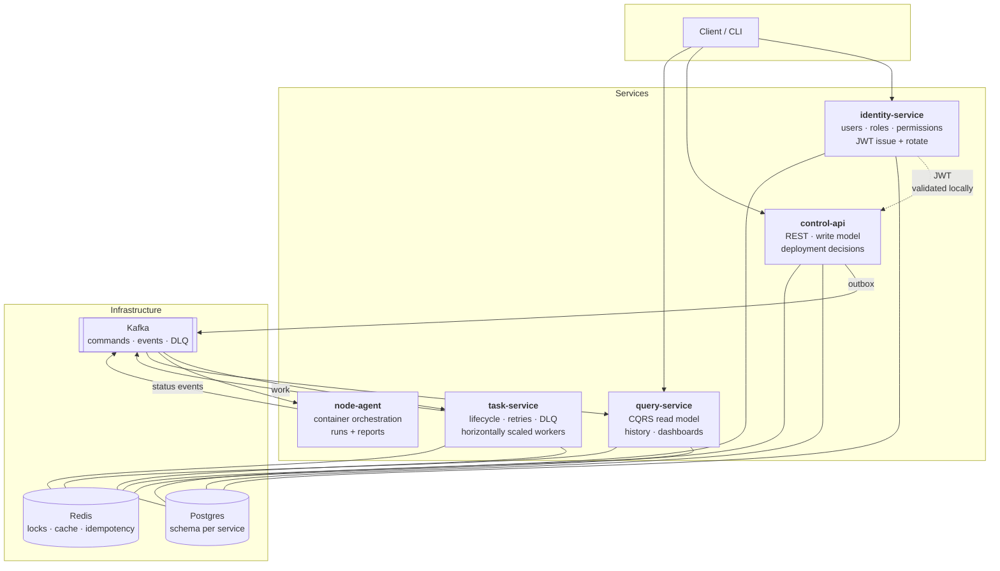
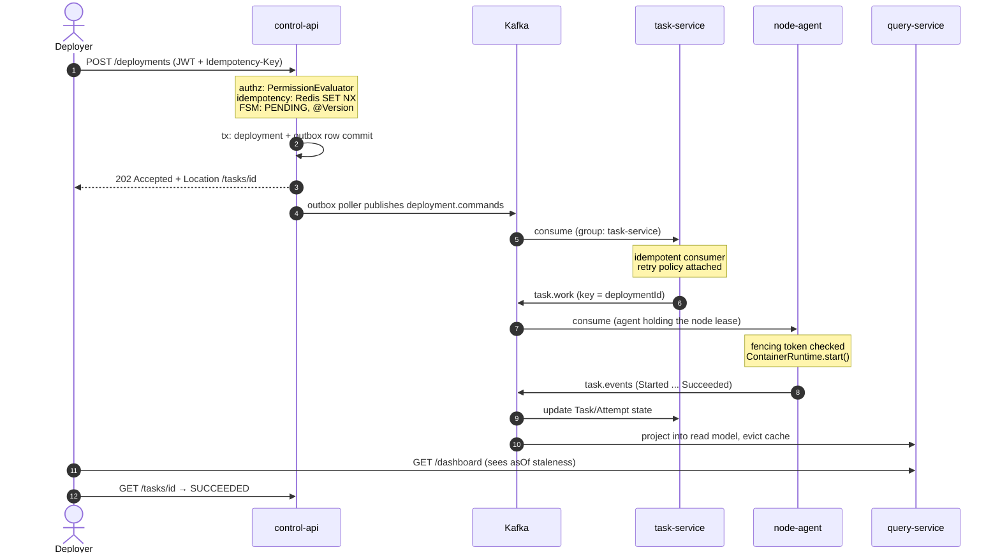

# The Spring Boot Project — build plan

**[← Interview Preparation](00-INDEX.md)** · **Modules:** [Syllabus](JAVA-SPRING-SYLLABUS.md) · **Coverage:** [Spring Boot Checklist](SPRING-BOOT-CHECKLIST.md) · **Schedule:** [Weeks 2–9](../plan/WEEKLY-PLAN.md)

> **The one thing this project is for:** Spring Boot is the only genuine gap on your résumé, and it is the one that cannot be closed by reading. **Every component below exists to unlock a specific interview answer** — nothing is here because it would be nice to have.

**A new project, not a rebuild.** No IP question, and it can be reverse-engineered from the checklists so every ● item gets code behind it. But the *shape* is yours — fleet, deployments, async tasks, state machines — so you will speak about it fluently.

**The story it buys:** *"I designed a container orchestration platform in production for a fleet across three continents. I wanted those control-plane problems in Spring Boot, so I built this as microservices on Kafka and Redis."*

---

## ⚠ Read this before starting

**Microservices roughly double the scope of this project.** Four services, Kafka, Redis and Postgres in eight part-time weeks is achievable, but only under one rule:

> **The system must be runnable and green at the end of every single slice.**

That is why the build below **starts as one service and splits deliberately** — not because monolith-first is a compromise, but because:

1. **You always have something to show.** Stop at Week 6 and you still have three working services
2. **The split itself is an interview answer.** *"I extracted the task service when the deployment write path and the execution path started needing different scaling and different failure semantics"* — that is a far better answer than *"I started with microservices"*, which reads as cargo cult
3. It is the **strangler pattern**, applied to your own code, which you can then talk about honestly

---

## The system



### The life of a deployment — the walkthrough diagram

**This is the diagram to draw from memory in an interview.** One request, touching every mechanism in the system:



**Rehearse narrating it in under two minutes**, naming the mechanism at each hop — authz, idempotency, outbox, partition ordering, lease + fencing, idempotent consumption, projection. Every number on this diagram is an interview answer you built.

### The five services

| Service | Owns | Why it exists *(as a boundary)* |
|---|---|---|
| **identity-service** | User, Role, Permission, Team, tokens | **Authentication and the RBAC model.** Issues JWTs the other services validate locally. **CPU-bound** — BCrypt is expensive by design, which is a real reason it scales differently |
| **control-api** | Application, Environment, Release, Deployment | The write model and the authority on *what should be true*. REST, **authorization**, validation |
| **task-service** | Task, Attempt, retry policy, DLQ | Different scaling profile and different failure semantics from the API. **Scaled horizontally** |
| **node-agent** | Node, container lifecycle, **sessions** | **The container orchestration piece.** **Pluggable runtimes** (`Docker` / `Simulated` / `Swarm`) behind one interface — the shape you already built three times in Automatter. Multiple instances, each leasing a node |
| **query-service** | Read models, history, dashboards | **CQRS read side**, built from events, Redis-cached. Scales reads independently |

> **The identity/authorization split is deliberate and worth being able to defend:** identity-service owns *who you are and what you may do in general*; control-api owns *whether you may do this to this object*. **Authentication centralises; authorization stays with the data.** Putting object-level rules in an auth service is a classic mistake — it needs the domain to answer.

**Plus one module, not a service:** a **catalogue** inside control-api — base image + layered per-app variants, versions, build/push/pull pipeline state. *(Apptbuilder’s shape.)* **Keep it a module.** *"I didn’t extract it because it has the same scaling profile and the same failure semantics as the API"* is a better answer than a fifth service.

**Domain model** *(inside control-api)*

```
Team ──1:N── User
 └──owns──> Application ──1:N──> Release
                 └──1:N──> Deployment  ✱ state machine
Environment ──1:N──> Node ──1:N──> Session   ✱ on-demand, idle-reaped
Deployment ──1:N──> Task ──1:N──> Attempt    ✱ owned by task-service
Catalogue: BaseImage ──1:N──> AppImage ──1:N──> ImageVersion
```

**Name: Appfleet** — your applications, run as a fleet. Same compound style as Apptbuilder, and it says what it does.

---
---

## What Apptbuilder and Automatter contribute

**You have already solved most of this once.** Reusing the *shapes* — not the code — means you can defend every design decision from experience rather than from a tutorial.

### From [Apptbuilder](../project-docs/07-apptbuilder.md) — the orchestration domain

| Their idea | Here |
|---|---|
| **Shared base image + layered per-app images** | The catalogue module: `BaseImage → AppImage → ImageVersion`. **Track and report layer reuse** — build time and registry size saved |
| **build / push / pull pipeline** | Pipeline state as a small state machine per image version, driven by tasks |
| **On-demand provisioning per session** | `POST /sessions` → node-agent provisions a container → idle timeout → **reaped**. This is where session density and cold start become measurable |
| **Per-app container, not a desktop VM** | The isolation model you argue for when asked *"why not VDI?"* |

> **The thesis this gives the project:** *"make heavyweight software available on demand, isolated, without local installation."* That is a decade-long through-line in your work — Apptbuilder → CONP → Automatter → Tracenet — and this project is its Spring rendering. **Having a point of view, not a list of features, is what reads as senior.**

### From [Automatter](../project-docs/02-automatter.md) — five things that map almost one-to-one

| You built | Spring equivalent | Slice |
|---|---|---|
| **`IKafkaConsumer` → polling *or* streaming, chosen by `KafkaConsumerProvider`** | Two `@KafkaListener` strategies — record vs **batch** — behind one interface, selected by config. **Strategy + Factory** | S4 |
| **`ActivityIdFilter` — MDC tracing, cleared per request** | The correlation-ID filter. **And reproduce the leak**: skip the clear, watch IDs bleed across pooled threads | S5 |
| **Three `ContainerManager`s** — full / lite / Swarm | `ContainerRuntime` with `Docker` / `Simulated` / `Swarm` impls, wired by `@ConditionalOnProperty` | S5 |
| **`IDalPlugin` + `DALCacheApi` with eviction** | Repository + **cache-aside with correct invalidation**, and a dedicated eviction test — you had one | S6 |
| **`AutomatterEndpointResolver`** — resolve services by logical name | A small **service registry in Redis**; agents register, control-api resolves | S5 |
| **`ServiceIdentifierAspect`** — AOP service tagging | A Spring **AOP aspect** tagging and timing every service call into metrics | S6 |
| **16 typed service clients published as a library** | A **typed client SDK module**, versioned and published — API design and backwards compatibility, demonstrated | S7 |

> **The line worth rehearsing:** *"I built a Kafka abstraction with two consumption strategies behind a provider, Activity-ID tracing through MDC, and three container-manager implementations behind one interface — in Play and Guice, around 2018. This project is me doing the same things in Spring, which is mostly a matter of learning the framework's names for them."*

## User management and RBAC — the deep section

**Spring Security is the second-densest interview surface after JPA**, and it is a ● section you currently have no code behind. This is the part of the project to over-build rather than under-build.

### The model — roles are not enough

```
User ──N:M── Role ──N:M── Permission        e.g. deployment:create, node:drain
 │                                                catalog:publish, user:manage
 └──N:M── TeamMembership ── Team
              │
              └── role is granted PER TEAM, not globally   ✱ the part most tutorials skip
```

- [ ] ● **Users** — registration, profile, password change, deactivate *(never hard-delete: audit)*
- [ ] ● **Roles** — `VIEWER`, `DEPLOYER`, `OPERATOR`, `ADMIN`
- [ ] ● **Permissions** — fine-grained verbs (`deployment:create`, `deployment:rollback`, `node:drain`, `catalog:publish`, `user:manage`); roles are bundles of them
- [ ] ◆ **Role hierarchy** — `ADMIN > OPERATOR > DEPLOYER > VIEWER` via `RoleHierarchy`, so you don't grant transitively by hand
- [ ] ◆ **Scoped grants** — a role is held **on a team**, not globally. *"Deployer on Team A, Viewer on Team B"*
- [ ] ◆ **Object-level authorization** — a custom `PermissionEvaluator`: *may this user deploy **this** application?* `@PreAuthorize("hasPermission(#appId, 'Application', 'deploy')")`
- [ ] ◆ **Service accounts** — node-agent and task-service authenticate as principals, not with a shared secret. API keys with scopes, rotatable
- [ ] ▲ **Delegated/impersonation** for admin support flows — and **audit every use**

### Authentication

- [ ] ● JWT: claims, signing *(RSA so other services verify without a shared secret)*, expiry
- [ ] ● **Refresh token rotation** — one-time-use refresh tokens; reuse means theft, so revoke the family
- [ ] ● BCrypt with a deliberate cost factor — **and know that this is why the service is CPU-bound**
- [ ] ◆ **Revocation** — a Redis denylist by `jti`, with TTL equal to remaining token life. **Then explain why short expiry + rotation is usually the better answer**
- [ ] ◆ **Account lockout** after N failures — a Redis counter with a sliding window
- [ ] ◆ Password policy, breach-list check, forced rotation on role change
- [ ] ◆ **Login audit** — success, failure, IP, user agent, correlation ID
- [ ] ▲ OAuth2 / OIDC resource-server mode as an alternative profile — *"the same API, with an external IdP"*

### Enforcement, at three layers

- [ ] ● **URL security** in the `SecurityFilterChain` — coarse
- [ ] ● **Method security** — `@PreAuthorize`, `@PostAuthorize`, `@PreFilter`, `@PostFilter`
- [ ] ◆ **Data-level filtering** — a team-scoped repository so a Viewer's list query cannot return another team's rows at all
- [ ] ◆ **Know which layer catches what**, and why relying on only one is how breaches happen

### The RBAC bugs to build deliberately

**These are the ones interviewers probe, and having caused them is the difference between an answer and a real answer.**

- [ ] **IDOR** — an endpoint that checks `hasRole('DEPLOYER')` but never checks *which application*. Exploit it in a test, then fix it with the `PermissionEvaluator`. **The single most common real-world authorization bug**
- [ ] **Stale permissions in a live JWT** — revoke a role, watch the old token still work until expiry. Then fix it, and **be able to argue both sides**: denylist *(correct, stateful)* vs short expiry + rotation *(simpler, eventually correct)*
- [ ] **`@PreAuthorize` silently skipped on self-invocation** — the same proxy limitation as `@Transactional`, and far more dangerous here
- [ ] **Method security not enabled** — annotations present, doing nothing. A quiet, total failure
- [ ] **Refresh token replay** — use one twice, and detect it

> **The interview line:** *"Authorization has three layers — URL, method, and data. I built an IDOR into my own project on purpose to see what only the object-level check catches."* Almost nobody says that.

### The actor model — deliberately absent, visibly present

You shipped Akka in production for years — actor-per-entity, a 27-state `AbstractFSM`, cluster sharding. **Appfleet deliberately uses no actor framework.** Two reasons worth saying out loud: the project must prove Spring idioms, not replay your old stack; and Akka's 2022 licence change (BSL — Pekko is the Apache fork) makes "would you adopt it today?" a real question with a real answer.

**But every guarantee the actor model gave you is in Appfleet — on a different substrate.** This mapping is the asset:

| Actor model guarantee | How Akka gave it to you | How Appfleet gives it |
|---|---|---|
| **One message at a time per entity** | the mailbox | **Kafka partition keyed by aggregate id** — all events for one deployment, in order, one consumer thread at a time |
| **State owned by exactly one writer** | actor-per-entity | **the fenced node lease** — one agent drives one node, stale writers rejected |
| **Explicit state machines** | `AbstractFSM` | the Deployment FSM — entity + State pattern, transitions atomic via `@Version` |
| **Supervision & restart** | supervisor strategy | **retry policy + DLQ + reaper** — failure handling as inspectable data, not a hierarchy |
| **Shard rebalancing** | cluster sharding | **consumer-group rebalancing** — partitions reassign when workers join or die |
| **Backpressure** | bounded mailboxes | bounded executors + 202/polling + load shedding |

**And the honest trade, both directions:** without actors you lose in-memory state locality (every mutation round-trips the database) and supervision as a first-class tree. You gain durability by default, no split-brain of in-memory state, and operations any team can read.

> **The rehearsed line — this is your "compare virtual threads to actors" answer, grounded in code:**
> *"Appfleet has no actor framework, but the actor model is all over it: the partition key is the mailbox, the fenced lease is actor-per-entity, the FSM entity is my old `AbstractFSM`, and retries-plus-DLQ are the supervision strategy. I've built this both ways — Akka in production for years, then the Spring rendering — so I can tell you precisely what each substrate buys and costs."*

### CRDTs — the other deliberate absence, and why it pairs with Garuda

You shipped CRDTs in production — Garuda's cluster state was an `ORMultiMap` with observed-remove semantics and quorum-tuned reads and writes. **Appfleet contains none, on purpose — and the two systems answer the same question in opposite directions.** That contrast is a staff-level answer you can give from two codebases you wrote.

| | **Garuda** *(convergence)* | **Appfleet** *(coordination)* |
|---|---|---|
| Concurrent writers | **Expected — merge them** (`ORMultiMap`, observed-remove) | **Forbidden — prevent them** (fenced lease, `@Version`, partition ordering) |
| During a partition | Keep accepting writes, converge on heal *(AP)* | Reject the stale writer, wait *(CP-leaning)* |
| The consistency knob | Quorum tuning — R + W > N | Transactions + a single writer per entity |
| Removing things | Observed-remove — tombstone reasoning | Row delete + append-only audit |
| Right for | Presence, membership, collaborative state | **Authoritative control state** |

**Why the difference is forced, not stylistic:** a deployment must have exactly one truth — **you cannot merge two conflicting deployments of different releases**; convergence is meaningless when the state drives real containers. Presence in Garuda is the opposite: concurrent updates are natural, merges are clean, and availability matters more than a single arbiter. **The fencing token is, precisely, the anti-CRDT — it exists to make concurrent writers impossible rather than mergeable.**

**The seam where CRDTs would re-enter** *(name it when asked about extensibility)*: if the requirement became *"agents keep operating through a control-plane partition and reconcile on heal"*, the fleet view would become a merge problem — node-local state as an OR-set, reconciled on rejoin. That is the moment this design would reach for CRDT semantics again, and knowing the trigger is the point.

> **The rehearsed line:** *"Garuda and Appfleet answer the same question opposite ways. Garuda's cluster state merged concurrent writers with an ORMultiMap under quorum consistency; Appfleet forbids concurrent writers with a fencing token and optimistic locking, because control-plane state can't be merged — you can't average two deployments. Knowing which regime a problem belongs to is the actual skill, and I've shipped both."*

## Infrastructure — and the question each piece answers

### Postgres

| Use | Unlocks |
|---|---|
| **Schema per service**, one instance | *"How do you isolate service data without four databases?"* |
| Flyway per service, versioned | *"Zero-downtime migrations?"* — expand/contract |
| 1M+ synthetic tasks for realistic plans | *"This query seq-scans a million rows…"* |
| **Transactional outbox** table in control-api | *"How do you publish reliably after a commit?"* |
| **`SELECT … FOR UPDATE SKIP LOCKED`** for task claiming | *"Queue in a table — how?"* and why you may not need Kafka for it |

### Redis

**Not just a cache.** Five distinct uses, each answering a different question:

- [ ] **Distributed lock / lease** — a node-agent leases a node so two instances never drive it *(`SET NX PX` + fencing token)*
- [ ] **Idempotency key store** — `POST /deployments` with a TTL'd key
- [ ] **Read-model cache** in query-service, with **correct invalidation on event**
- [ ] **Rate limiting** — token bucket per team, distributed
- [ ] **Sorted set** for the node heartbeat registry — *"which nodes are alive?"* in O(log n)
- [ ] **Service registry** — agents register under a logical name, control-api resolves *(Automatter’s `EndpointResolver`)*

> **The interview point:** *"Redis is a cache"* is an incomplete answer. Having used it as a lock, a rate limiter, an idempotency store and a heartbeat registry is a much stronger one — and you will have.

⚠ **Know the trap:** a Redis lock is **not** safe under partition without fencing tokens. Build the fencing token, and be ready for the Redlock debate — that awareness is a senior signal.

### Kafka

| Topic | Carries | Unlocks |
|---|---|---|
| `deployment.commands` | control-api → task-service | producer `acks`, partitioning **by deployment id for ordering** |
| `task.work` | task-service → node-agent | **consumer groups**, rebalancing, scaling workers |
| `task.events` | node-agent → everyone | fan-out to multiple consumer groups |
| `deployment.events` | → query-service | **CQRS projection**, eventual consistency |
| `*.DLT` | poison messages | **dead-letter topics + replay** |

- [ ] **Idempotent consumers** — because at-least-once is what you actually get
- [ ] **Ordering by partition key**, and being able to say *"ordering is per-partition, not global"*
- [ ] Schema evolution — add a field without breaking consumers
- [ ] **The outbox**, so a DB commit and a Kafka publish can't diverge

> **Your unfair advantage here:** you ran **NATS** in production and hand-wrote a client. **"Kafka vs NATS: what I learned running both"** is a genuinely rare piece — write it in Slice 5 and publish it.

---

## Scalability — what you will actually demonstrate

**Claiming "scalable" is worthless. Measuring it is not.** This is the section that separates the project from every other portfolio repo.

### Why five services — each is bound by something different

**This table is the answer to "why did you split these?"** If two services had the same bottleneck, they should not be two services.

| Service | Bound by | Scale on | What caps it |
|---|---|---|---|
| **identity-service** | **CPU** — BCrypt is deliberately expensive | CPU %, login rate | CPU cores. Genuinely does not scale like the others |
| **control-api** | **Request rate**, DB writes | RPS, p99 latency | **DB connection pool**, not instances |
| **task-service** | **Queue depth** | **Kafka consumer lag** | **Partition count** — extra consumers sit idle |
| **node-agent** | **Number of nodes** | nodes per agent | **Leases are 1:1 with nodes** — scaling past node count buys nothing |
| **query-service** | **Read rate** | RPS, cache hit ratio | Redis, then read replicas |

- [ ] **Every service stateless** — JWT verified locally with the public key, no shared session, no sticky routing. *That* is what makes independent scaling possible
- [ ] **`docker compose up --scale task-service=6`** — and a load balancer in front of the stateless HTTP services
- [ ] **Graceful shutdown everywhere** — scale-down must not drop in-flight work. Prove it: scale down under load, show zero lost tasks
- [ ] **Readiness vs liveness** — a service that is up but not ready must not receive traffic
- [ ] **Per-service resource profiles** in compose — they are genuinely different, and saying so is the point

- [ ] **Scale task-service 1 → 3 → 6** and chart throughput. **Find where it stops being linear** *(partition count caps consumer parallelism)*
- [ ] **Scale identity-service under login load** — show it is **CPU-bound on BCrypt**, and that lowering the cost factor trades security for throughput. A real, uncomfortable trade-off
- [ ] **Scale control-api and show it does *not* help** past a point — the DB pool is the ceiling. **The most instructive result in the whole exercise**
- [ ] **Partition count vs consumer count** — demonstrate that consumers beyond partition count sit idle
- [ ] **Backpressure**: bounded executors and bounded queues; show what happens when you remove the bound *(OOM, not graceful degradation)*
- [ ] **Load shedding** — reject with 429 rather than queue unboundedly
- [ ] **Connection pool sizing**: show that doubling HikariCP pool size does **not** double throughput, and say why
- [ ] **Read scaling**: query-service with Redis cache, hit ratio measured, and the **stampede** on a hot key reproduced then fixed
- [ ] **A load test** — k6 or Gatling — with p50/p95/p99 recorded **before and after** one optimisation
- [ ] **Session density and cold start** — how many concurrent sessions per node before latency degrades, and **warm-pool vs cold-start** measured *(Apptbuilder’s real problem)*
- [ ] **Layer reuse** — build time and registry size with a shared base image vs without. A real number from your own catalogue
- [ ] **A capacity note**: at what request rate does this design fail, and what breaks first?

> **That last one is your signature move.** You already wrote a capacity audit concluding your own production system fails at 50×10, with every number labelled MEASURED / DERIVED / ASSUMED. **Do the same here.** Publishing the limits of your own design is the rarest credibility signal available, and you have done it before.

---
---

## The implementation specs — build each module yourself

**Detailed per-module specs, written to be implemented by hand — what to build and why, never the code:**

| | Spec | What it covers |
|---|---|---|
| — | **[Business Requirements](project/06-BUSINESS-REQUIREMENTS.md)** | **Read first.** The need in plain words, personas → RBAC, FR/NFR with numbers, the narrative arc to rehearse |
| 0 | **[Build Guide](project/00-BUILD-GUIDE.md)** | Repo layout, conventions (errors, pagination, IDs, topics), infrastructure, definition of done |
| 1 | **[control-api](project/01-CONTROL-API.md)** | The write model across four slices — schema, JPA, REST, outbox, the FSM |
| 2 | **[identity-service](project/02-IDENTITY-SERVICE.md)** | The full RBAC model, JWT + rotation, the five security bugs |
| 3 | **[task-service](project/03-TASK-SERVICE.md)** | Kafka consumption, retries with jitter, SKIP LOCKED, DLQ, graceful shutdown |
| 4 | **[node-agent](project/04-NODE-AGENT.md)** | Pluggable runtimes, the fencing-token lease, sessions, MDC across Kafka |
| 5 | **[query-service](project/05-QUERY-SERVICE.md)** | CQRS projections, rebuild-from-topic, cache-aside done properly |

---

## The build, slice by slice

Each slice lands in the week of its module. **Green build at the end of every slice.**

### Slice 0 · Week 2 — Skeleton *(module S1)*
Single service. Boot 4.1.x, Java 21+, Postgres + Redis + Kafka in one `docker compose`.
- [ ] `@ConfigurationProperties` with validation; profiles
- [ ] **Write your own starter + auto-configuration** — `fleet-audit-starter`, with `@ConditionalOnProperty` / `@ConditionalOnMissingBean`
- [ ] Actuator green
> *"How does Boot decide to configure a DataSource?"* · **"Have you written an auto-configuration?"**

### Slice 1 · Week 3 — Schema and SQL *(module D1)*
- [ ] **3NF on paper first** — keep the paper. Flyway from migration one
- [ ] Deliberately denormalise `deployment.current_status`, **write the justification**
- [ ] 1M synthetic tasks; **window function** (latest deployment per app per env); **recursive CTE** (step dependencies)
- [ ] **Slow query → `EXPLAIN ANALYZE` → index → record before/after**
- [ ] **Reproduce a deadlock**, fix with lock ordering
> The whole of [SQL §4–7](SQL-DBMS-CHECKLIST.md), from lived experience

### Slice 2 · Week 4 — JPA *(module S2)*
- [ ] Real relationships, owning side correct
- [ ] **Build the N+1**, watch it, fix it **three ways**, compare SQL
- [ ] **`@Version`** on Deployment — two concurrent updates, one loses
- [ ] `LazyInitializationException`, fixed **without** `open-in-view`
- [ ] **`@Transactional` self-invocation doing nothing** — keep the broken version as a test
- [ ] `REQUIRES_NEW`: audit rows survive a rolled-back deployment
> *"Three ways to fix an N+1?"* · *"Why didn't `@Transactional` roll back?"*

### Slice 3 · Week 5 — REST + Redis *(module S3)*
- [ ] CRUD, Bean Validation, **`ProblemDetail`** everywhere
- [ ] **Cursor pagination** on task history; keep an offset endpoint to benchmark at 1M rows
- [ ] **Idempotency keys in Redis** on `POST /deployments`
- [ ] **Rate limiting** — distributed token bucket per team
- [ ] `202 Accepted` + `Location`; `GET /tasks/{id}` polling
> *"Offset vs cursor?"* · *"How do you make a POST idempotent?"* · *"Distributed rate limiting?"*

### Slice 4 · Week 6 — RBAC + ★ the first splits *(module S4)*
- [ ] **The full RBAC model** — User / Role / Permission / Team, scoped grants, role hierarchy *(see the RBAC section)*
- [ ] JWT with RSA signing, **refresh rotation**, Redis denylist, lockout
- [ ] **Object-level `PermissionEvaluator`** — and **build the IDOR first**, exploit it in a test, then fix it
- [ ] Admin APIs for user/role management + self-service profile
- [ ] ★ **Extract `identity-service`** — it authenticates; everyone else validates the JWT locally
- [ ] **One custom filter**, correctly placed
- [ ] ★ **Extract `task-service`.** Introduce Kafka: `deployment.commands`, **transactional outbox** in control-api, idempotent consumer in task-service
- [ ] **Two consumption strategies** — record vs batch listener behind one interface, chosen by config *(Automatter’s `KafkaConsumerProvider`, in Spring)*
- [ ] **Write down why you split it** — different scaling profile, different failure semantics
> **Draw the filter chain from memory** · *"How do you publish reliably after a commit?"*

### Slice 5 · Week 7 — node-agent + observability *(module S5)*
- [ ] ★ **Extract `node-agent`** — the container orchestration service. Consumes `task.work`, drives containers, emits `task.events`
- [ ] **Pluggable `ContainerRuntime`** — `Docker` / `Simulated` / `Swarm`, wired by `@ConditionalOnProperty` *(your three `ContainerManager`s, in Spring)*
- [ ] **On-demand sessions** — `POST /sessions` provisions from the catalogue, idle timeout reaps it
- [ ] **Service registry in Redis** — agents register by logical name
- [ ] **Redis lease + fencing token** so two agents never drive one node
- [ ] Heartbeat via Redis sorted set; **custom `HealthIndicator`** = fleet health
- [ ] **Testcontainers** — Postgres **and** Kafka **and** Redis
- [ ] **MDC correlation IDs propagated across Kafka** *(header in, MDC out)* — the hard and impressive version
- [ ] Three business metrics; structured JSON logging
- [ ] **Write "Kafka vs NATS: what I learned running both"** and publish it
> *"How do you trace a request across services?"* — **across a message broker** is the senior version

### Slice 6 · Week 8 — Patterns, CQRS, async *(module P1)*
- [ ] **Deployment state machine** — `PENDING → VALIDATING → DEPLOYING → HEALTHY | FAILED | ROLLED_BACK`. **State pattern**, illegal transitions rejected
- [ ] **Pluggable step executors** — `ShellStep`, `HttpStep`, `WaitStep`. **Strategy** behind a **Factory**
- [ ] ★ **Extract `query-service`** — CQRS read model projected from `deployment.events`, Redis-cached with **event-driven invalidation**
- [ ] **`@Scheduled` reaper** for stale tasks — solve the **fires-on-every-instance** problem
- [ ] **`@TransactionalEventListener(AFTER_COMMIT)`**
- [ ] **AOP aspect** tagging and timing every service call into Micrometer *(your `ServiceIdentifierAspect`)*
- [ ] **Cache-aside with a dedicated eviction test** *(your `DALCacheApi` had one — most codebases do not)*
- [ ] **Saga**: deployment rollback as compensating actions
> *"`@Scheduled` on three instances?"* · *"CQRS — does it need event sourcing?"* · *"Saga vs 2PC?"*

### Slice 7 · Week 9 — Resilience, scale, polish
- [ ] **Timeouts always**, retry with **backoff + jitter**, **circuit breaker**, **bulkhead** on all inter-service calls
- [ ] **DLQ + replay** endpoint
- [ ] **The scalability measurements above** — run them, chart them, write them up
- [ ] Graceful shutdown, readiness/liveness, rolling restart without dropped work
- [ ] **A typed client SDK module** — published, versioned, with a note on what you may and may not change without breaking callers *(your 16 typed service clients, generalised)*
- [ ] **README as a design doc** + architecture diagram + the write-ups
> *"Circuit breaker vs bulkhead vs retry?"* · *"What breaks first at 10×?"*

---
---

## Build the bug, then fix it

**This is what separates your answers from everyone else's.** Keep each as a disabled test or a documented branch — the evidence is the point.

- [ ] **N+1**, fixed three ways *(S2)*
- [ ] **`@Transactional` self-invocation** doing nothing *(S2)*
- [ ] **Checked exception not rolling back** by default *(S2)*
- [ ] **`LazyInitializationException`** outside the transaction *(S2)*
- [ ] **Optimistic lock failure** on concurrent deployment *(S2)*
- [ ] **A real deadlock** across two sessions *(S1)*
- [ ] **Deep `OFFSET`** vs cursor at 1M rows *(S3)*
- [ ] **Lost update without a fencing token** — two agents, one node *(S5)*
- [ ] **Consumer group rebalance** dropping in-flight work, then fixed *(S5)*
- [ ] **Duplicate delivery** — the same event twice, before the idempotent consumer *(S4)*
- [ ] **Outbox proving its worth** — kill the app between DB commit and publish *(S4)*
- [ ] **`@Scheduled` firing on every instance** *(S6)*
- [ ] **Unbounded executor queue** → OOM instead of backpressure *(S6)*
- [ ] **Cache stampede** on a hot key *(S6)*
- [ ] **MDC leaking across pooled threads** — skip the per-request clear and watch one request log another’s correlation ID *(S5)*. **The bug most people miss, and you already know it**
- [ ] **Stale cache after an update** — no eviction, then the eviction test *(S6)*
- [ ] **Consumers > partitions** sitting idle *(S7)*
- [ ] **IDOR** — role checked, object not *(S4)*
- [ ] **Stale permissions in a live JWT** after revoking a role *(S4)*
- [ ] **`@PreAuthorize` skipped on self-invocation** *(S4)*
- [ ] **Work dropped on scale-down** without graceful shutdown *(S7)*

> **Rehearse the phrasing:** *"I hit that — here's what it looked like and here's what I changed."* You can only say it if you built the failure on purpose.

---

## The interview-answer map

| Question | What you build |
|---|---|
| How does auto-configuration decide? | S0 — your own starter |
| Walk me from unnormalized to 3NF | S1 — the paper schema |
| This query is slow — what do you check? | S1 — `EXPLAIN ANALYZE`, before/after |
| Three ways to fix N+1? | S2 — all three, with SQL |
| Why didn't `@Transactional` roll back? | S2 — the deliberate break |
| Offset vs cursor? | S3 — benchmarked at 1M rows |
| How do you make a POST idempotent? | S3 — Redis keys |
| Distributed rate limiting? | S3 — token bucket in Redis |
| Draw the security filter chain | S4 — your filter in it |
| Roles or permissions — which and why? | S4 — both, roles as bundles |
| How do you do object-level authorization? | S4 — `PermissionEvaluator`, after building an IDOR |
| A user's role is revoked — when does their token stop working? | S4 — denylist vs short expiry, both sides |
| How do services authenticate to each other? | S4 — service accounts, scoped API keys |
| Why did you split these services? | **The bottleneck table** — each bound by something different |
| Does adding instances always help? | S7 — control-api capped by the DB pool |
| Reliable publish after commit? | S4 — the outbox |
| Exactly-once — really? | S4 — at-least-once + idempotent consumer |
| Trace a request across services? | S5 — MDC **across Kafka** |
| Distributed lock — is it safe? | S5 — lease + **fencing token** |
| `@Scheduled` on three instances? | S6 — the lock fix |
| CQRS — does it need event sourcing? | S6 — read model, no event sourcing |
| Saga vs 2PC? | S6 — rollback compensation |
| Circuit breaker vs bulkhead? | S7 — both, on inter-service calls |
| What breaks first at 10×? | S7 — **the capacity note** |
| Why did you split these services? | S4/S5/S6 — **written down at the time** |
| Why not just use VDI? | Sessions — per-app containers, isolation model |
| Why a shared base image? | The catalogue — layer reuse, measured |
| How do you resolve services? | S5 — Redis registry |
| What can you change in a published API? | S7 — the client SDK |
| Compare virtual threads / Kafka to the actor model | **The actor mapping table** — built both ways |
| When would you use a CRDT — and when not? | **The Garuda ↔ Appfleet contrast** — convergence vs coordination, shipped both |
| Tell me about a system you designed | **The README** |

---

## What goes on GitHub

- [ ] **A README that reads like a design doc** — the model, **the trade-offs taken and rejected**, the numbers
- [ ] **Three Mermaid diagrams, rendering natively on GitHub:** the system graph, **the life-of-a-deployment sequence**, and the deployment state machine — the same three you can draw on a whiteboard
- [ ] `/docs`: the N+1 write-up · the query-optimisation numbers · **the scalability report** · **the capacity note** · *"Kafka vs NATS"*
- [ ] **`docker compose up && mvn verify` works from a clean clone.** Test on a different machine
- [ ] GitHub Actions running the Testcontainers suite — green badge
- [ ] **Commit history showing the slices**, including the two service extractions

---

## What NOT to build

Scope creep is how this fails. **These are defensible omissions** — *"I deliberately didn't build that, because…"* is itself a senior answer:

- ❌ **A UI.** None. Weeks of work, demonstrates nothing being tested
- ❌ **More than four services.** Four is enough to show the patterns; eight is a distributed monolith with extra steps
- ❌ **Kubernetes.** `docker compose` is enough — and you can *speak* to K8s from Tracenet anyway
- ❌ **Service mesh, API gateway, config server.** Name them as things you'd add and why; don't build them
- ❌ **Real cloud deployment.** Local is fine. Nobody clones and deploys your repo
- ❌ **Event sourcing.** CQRS without it is the honest, common choice — and defending that is better than building it

---

## Weekly rhythm

**~9 hrs/week** — the 4-hour weekend Build block plus the 1-hour weekday evening slot.

| | |
|---|---|
| **Weekend, 4 hrs** | The slice's main build |
| **Weekday evenings, 1 hr** | Tests, the deliberate bug, the write-up |
| **Every Sunday** | Does `docker compose up && mvn verify` still pass from a clean clone? |

- [ ] **Commit every session**, even incomplete — the history is evidence
- [ ] **Never two weeks without a green build.** That is the point where projects die
- [ ] **If you fall behind, cut a service — not the write-ups.** Three services with measurements beat four without
