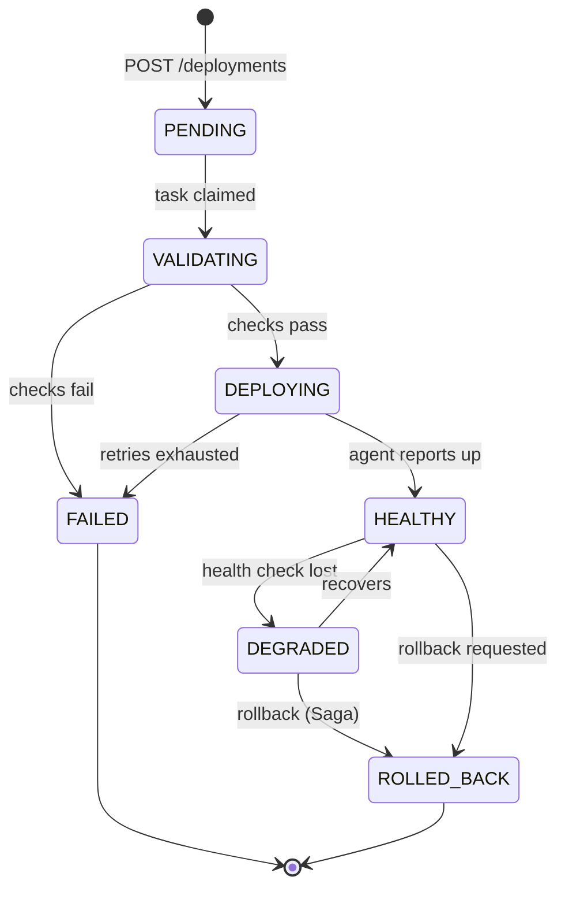

# control-api — implementation spec

**[← Build Guide](00-BUILD-GUIDE.md)** · Slices **S0–S3, S6** · Port **8081** · Schema **`control`**

The write model and the authority on *what should be true*. The largest module, built across four slices — everything else was extracted from it or consumes its events.

---

## Domain model

```
Application ──1:N──> Release            (version, artifactRef, checksum)
     │
     └──1:N──> Deployment  ✱ state machine — (application × environment × release)
                    │
                    └── currentStatus   ✱ deliberately denormalised (see S1)

Environment ──1:N──> Node               (owned here; leased by node-agent)

Catalogue (module):  BaseImage ──1:N──> AppImage ──1:N──> ImageVersion
                                                              └── pipelineState  ✱ FSM

AuditEvent           (append-only; written via AFTER_COMMIT)
OutboxMessage        (the transactional outbox)
```

**Ownership note:** `Team` and `User` live in **identity-service** after the S4 split. control-api keeps only `ownerTeamId` on Application — a reference by id, never a JPA relationship across a service boundary. **Be able to say why.**

### The Deployment state machine



- [ ] Model states as an enum owning its **legal transitions** — an illegal transition throws, always, no flag to bypass
- [ ] Transitions emit events; **status is never set directly** by a controller
- [ ] *(S6)* refactor to the **State pattern** and write down what the refactor bought you over the enum switch — that comparison is an interview answer

---

## S0 — Skeleton

- [ ] Boot 4.1.x, Java 21+, module builds inside the parent
- [ ] `@ConfigurationProperties(prefix = "appfleet")` — typed, validated (`@Validated`, `@NotBlank`), fail-fast on bad config. **No `@Value` anywhere**
- [ ] Profiles: `local`, `test`, `prod` — and know the **property precedence order** you're relying on
- [ ] **`fleet-audit-starter`** *(separate module)*: auto-configured audit logging behind `@ConditionalOnProperty(appfleet.audit.enabled)` and `@ConditionalOnMissingBean`. Prove both conditions with `ApplicationContextRunner` tests
- [ ] Actuator: health, info, metrics exposed; everything else locked
- [ ] Run the app with `--debug` once and **read the conditions evaluation report** — find your own starter in it

> **Unlocks:** *"How does Boot decide to configure a DataSource?"* · *"Have you written an auto-configuration?"*

---

## S1 — Schema and SQL

- [ ] **Design in 3NF on paper first.** Photograph the paper into `/docs` — it is the artefact for *"walk me from unnormalized to 3NF"*
- [ ] Flyway from `V1__`. **Never `ddl-auto` beyond `validate`**
- [ ] Constraints in the database, not just JPA: FKs, `CHECK` on state values, partial unique index — **one active deployment per (application, environment)**
- [ ] **The deliberate denormalisation:** `deployment.current_status` duplicated from task history. Write the justification in `/docs` — read path, write path, what keeps it consistent *(the AFTER_COMMIT listener)*, and what could make it drift
- [ ] **Seed 1M+ synthetic tasks/attempts** with a generator — realistic skew: a few hot applications, many quiet ones
- [ ] **The window-function report:** latest deployment per application per environment — `ROW_NUMBER() OVER (PARTITION BY ...)`, top-N per group
- [ ] **The recursive CTE:** image lineage — walk `AppImage → BaseImage` ancestry
- [ ] **The performance exercise:** find the seq scan on task history, `EXPLAIN ANALYZE` it, design the right **composite index** *(leftmost-prefix rule applies — document the column order reasoning)*, measure again. **Before/after numbers into `/docs`**
- [ ] **The deadlock:** two `psql` sessions updating deployment + application in opposite orders. Capture the Postgres deadlock log, fix with consistent lock ordering, write the note

> **Unlocks:** the whole of [SQL checklist §4–7](../SQL-DBMS-CHECKLIST.md) from lived experience.

---

## S2 — JPA

- [ ] Entities mirroring the schema — **the schema owns the truth**, JPA maps it
- [ ] Relationships with the **owning side chosen consciously**; every association `LAZY`
- [ ] **Build the N+1 first:** list 50 deployments with their tasks, SQL logging on, count the 51 queries. Fix it three ways — `JOIN FETCH`, `@EntityGraph`, `@BatchSize` — and **diff the generated SQL in `/docs`**
- [ ] **`@Version` on Deployment.** Test: two threads load the same deployment, both transition it, one gets `OptimisticLockException`. Decide and document the retry-vs-fail policy
- [ ] **Trigger `LazyInitializationException`** by touching tasks outside the transaction. Fix without `open-in-view` — then **turn `open-in-view` off globally** and write down why it's on by default and why you disagree
- [ ] **The self-invocation bug:** a `@Transactional` method called from a sibling method in the same class — prove the transaction never opened, fix by extracting the collaborator. **Keep the broken version as a `@Disabled` test**
- [ ] **Rollback rules:** throw a checked exception mid-transaction, watch it commit anyway. Then `rollbackFor`. Keep both tests
- [ ] **`REQUIRES_NEW` where it matters:** audit rows must survive a rolled-back deployment. Test proves the deployment rolled back *and* the audit row exists
- [ ] Repositories: derived queries where trivial, `@Query` where not, **interface projections** for list views *(and check the SQL selects only those columns)*

> **Unlocks:** *"Three ways to fix an N+1"* · *"Why did `@Transactional` not roll back?"* · *"Give me a case where `REQUIRES_NEW` matters"* — all from things you watched happen.

---

## S3 — REST + Redis

**Endpoints** *(shape, not exhaustive)*:

```
POST   /api/v1/applications                 201 + Location
GET    /api/v1/applications?cursor=&limit=
POST   /api/v1/applications/{id}/releases
POST   /api/v1/deployments                  202 + Location: /tasks/{id}   ✱ Idempotency-Key
GET    /api/v1/deployments/{id}
POST   /api/v1/deployments/{id}/rollback    202
GET    /api/v1/deployments/{id}/tasks?cursor=
GET    /api/v1/catalogue/images ...
```

- [ ] Bean Validation on every request DTO; **DTOs are records**; MapStruct or hand mapping — never entities out of controllers
- [ ] `@RestControllerAdvice` → **`ProblemDetail`** for every failure: validation, not-found, conflict, illegal transition, optimistic-lock. **One shape. Write a test asserting the shape for each**
- [ ] Status codes precisely: 400 vs 422, 404 vs 403 *(and the information-leak reason you might return 404 for both)*, 409 for state conflicts, **202 + `Location`** for async
- [ ] **Cursor pagination** on task history — opaque cursor (encoded keyset), stable under concurrent inserts. **Keep an offset endpoint too, and benchmark both at page 10,000** — numbers into `/docs`
- [ ] **Idempotency keys in Redis:** `SET NX` with TTL; same key → the original response replayed; in-flight duplicate → 409. Test: two concurrent identical POSTs, exactly one deployment
- [ ] **Rate limiting:** token bucket per team in Redis — atomic via a small Lua script or `DECR`-with-expiry pattern; 429 + `Retry-After` when empty
- [ ] OpenAPI via springdoc — grouped, described, with the error shapes documented

> **Unlocks:** *"Offset vs cursor?"* with your own benchmark · *"How do you make a POST idempotent?"* · *"Distributed rate limiting?"*

---

## S4 — the split (what control-api loses and gains)

- [ ] **Loses** User/Team tables → identity-service. Keeps `ownerTeamId` as a plain column
- [ ] **Gains** JWT validation via `common-security` — the RSA public key, no network call to identity
- [ ] **Gains the object-level check:** custom `PermissionEvaluator` — *may this user deploy **this** application?* — backed by team membership claims in the token plus `ownerTeamId`
- [ ] **Build the IDOR first:** the deploy endpoint checks `hasRole('DEPLOYER')` only. Write the exploit test — deployer on Team A deploys Team B's application. **Then** add `@PreAuthorize("hasPermission(...)")` and watch the exploit fail
- [ ] **Gains the outbox:** `OutboxMessage` written in the same transaction as the state change; a poller publishes to Kafka, marks sent, deletes. **Kill-test:** stop the app between commit and publish, restart, prove the message still goes out

> **Unlocks:** *"How do you do object-level authorization?"* · *"How do you publish reliably after a commit?"*

---

## S6 — CQRS emission + patterns

- [ ] Domain events (`DeploymentRequested`, `DeploymentSucceeded`, …) → outbox → `deployment.events`
- [ ] **`@TransactionalEventListener(AFTER_COMMIT)`** for audit + the denormalised status — test that a rollback produces neither
- [ ] The State-pattern refactor of the FSM *(see top)*
- [ ] **The `@Scheduled` reaper** for stuck deployments — then prove it fires on every instance when scaled, then fix with a Postgres advisory lock or `SKIP LOCKED` claim table

---

## Deliberate bugs owned by this module

| Bug | Slice | Keep as |
|---|---|---|
| N+1 (51 queries) | S2 | `@Disabled` test + SQL diff in `/docs` |
| `@Transactional` self-invocation | S2 | `@Disabled` test |
| Checked exception commits anyway | S2 | paired tests |
| `LazyInitializationException` | S2 | `@Disabled` test |
| Optimistic-lock collision | S2 | test + policy note |
| Deadlock | S1 | log capture + note |
| Deep OFFSET vs cursor | S3 | benchmark in `/docs` |
| **IDOR** | S4 | exploit test, then fixed |
| Reaper fires on every instance | S6 | test, then lock fix |

## Definition of done

- [ ] Everything in [00-BUILD-GUIDE.md](00-BUILD-GUIDE.md) §Definition of done
- [ ] `mvn verify` green with Testcontainers Postgres + Redis + Kafka
- [ ] The four `/docs` artefacts exist: 3NF paper, N+1 SQL diff, index before/after, pagination benchmark
